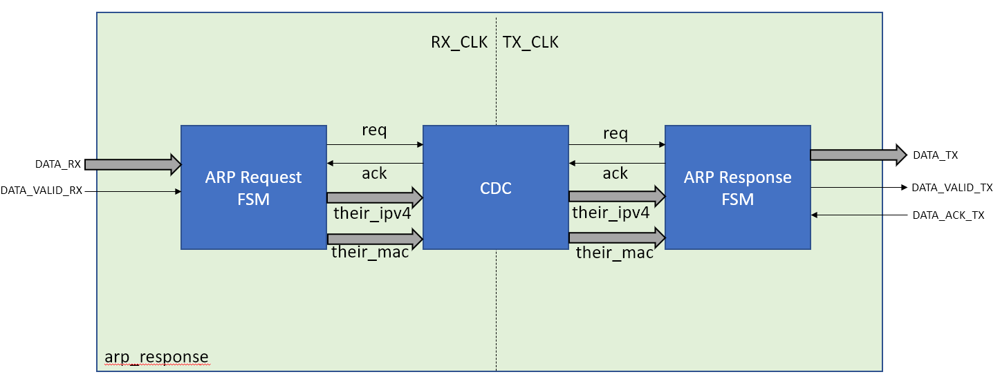

# arp_response

The Arp Response module is designed to receive, parse, and check Ethernet frames coming
from a MAC interface for an ARP Request. If a valid ARP request is detected, an ARP response
is transmitted.

## Scripts:

Some tcl scripts were added to synthesize and simulate the module using the Vivado toolset.
This was tested with Vivado 2021.1 and uses the XC7Z020clg400-1 part which is available in the
web pack without an additional license. If needed, the Part can be changed in the first line
of the scripts.

### Steps to Synthesize:

1. Open Vivado
2. Run the following commands in the tcl console
   1. `cd {arp_response_repo}/scripts`
   2. `source ./synth.tcl`

### Steps to Simulate:

1. Open Vivado
2. Run the following commands in the tcl console
   1. `cd {arp_response_repo}/scripts`
   2. `source ./sim.tcl`

## Design:

### Request State Machine:

The ARP Request State Machine tracks incoming ethernet frames and checks its contents for an IPV4 arp request. It assumes
that the frames are bounded by the DATA_VALID_RX signal and that it does not drop midframe.

### ARP Response Handshake:

A request and acknowledge handshake is used to pass the requesting machine's stable ipv4 and mac address from the rx clock domain to the tx clock domain.

### Response State Machine:

The Response state machine outputs an arp response to the requesting machine after receiving a valid arp request.
